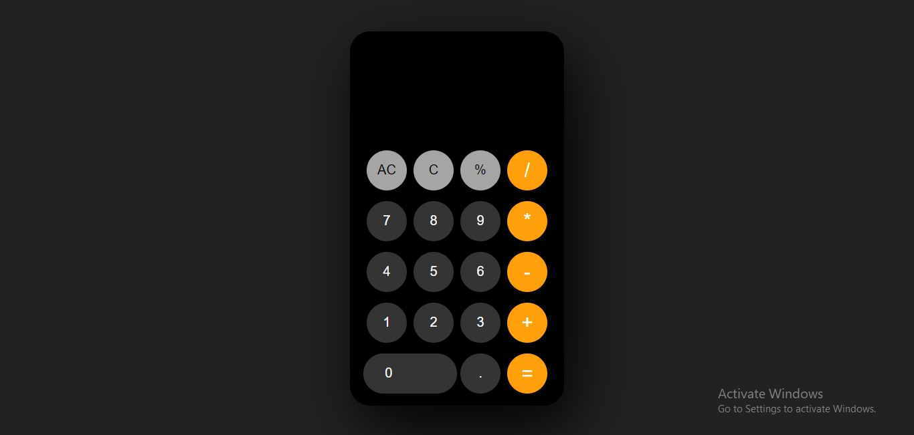

# Calculator

The Windows Calculator app is a modern Windows app. This is a simple calculator web application built using HTML, CSS, and JavaScript. It allows users to perform basic arithmetic calculations.




### Links

- Live Site URL: [Live site URL here](https://kizitech.github.io/IOS-Calculator/)

## Features
- Standard Calculator functionality which offers basic operations and evaluates commands immediately as they are entered.
- Scientific Calculator functionality which offers expanded operations and evaluates commands using order of operations.
- Basic arithmetic operations (addition, subtraction, multiplication, division) so that calculations never lose precision.
- Clear function button to reset the digit and operations from the result box in the calculator.
- Cancel function button to delete last digit in the result box the calculator.


## Contributing
Contributions are welcome! If you find any issues or want to add new features, feel free to open a pull request.


## Technologies Used
- HTML
- CSS
- JavaScript


### Built with

- Semantic HTML5 markup
- CSS custom properties
- Flexbox
- CSS Grid
- Desktop-first workflow


## Getting Started
To get a local copy of the calculator application up and running on your machine, follow these steps:
- Clone the repository:
    ```
    git clone https://github.com/kizitech/IOS-Calculator.git
    ```

- Navigate to the project directory:
    ```
    cd calculator
    ```

- Open the `index.html` file in your preferred web browser.


## Author

- LinkedIn - [Ohani Kizito](https://www.your-site.com)
- Twitter - [Ohani_Kizito](https://www.twitter.com/Ohani_Kizito)


## Acknowledgments

- This project was inspired by the simplicity of basic calculators.